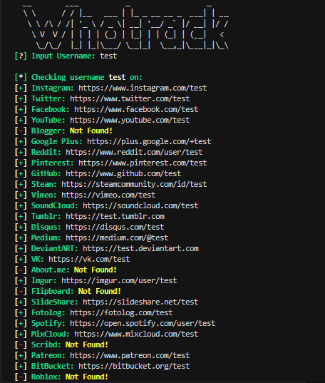

# Whotrack
> Find usernames across over 75 social networks

<p align="center">

</a>
</p>

## Installation

```bash
# clone the repo
https://github.com/codewithzaqar/whotrack.git

# change the working directory to whotrack
$ cd whotrack

# install the requirements
$ pip install -r requirements.txt
```

## Usage
Just run ```python whotrack.py```


## License
MIT License

Copyright (c) 2025 Zaqar Hakobyan